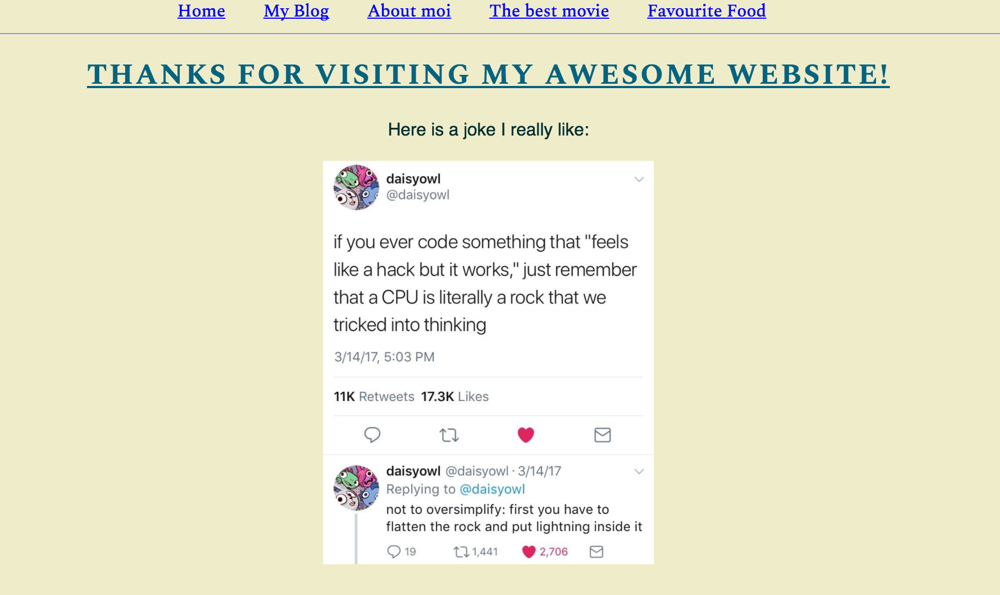

## React Router Deliverable

1. Your assignment is to make a personal website that looks like this:  

1. It should have five pages:

        Home

        My blog

        About moi

        Favorite Movies

        Favorite Food

1. Each page should be a component. 

1. Create a navigation menu of list items that Route to each page. 

1. On the "Favorite Movies" page, use the attached favoriteMovies.js to display content for these movies:

        Shazam

        Captain Marvel

        Escape Room 

        How to Train Your Dragon: The Hidden World

        Glass

        Doraemon the Movie: Nobita's Treasure Island

        Dumbo

        Avengers: Infinity War

1. Clicking on one of these links should display

        Overview

        Release Date

        Poster
1. The other pages don't need to have much content — just the header at the top saying what the page is and a paragraph description of your choosing.

        
<strong>Need a hint?</strong>
 
  
Take a look at <a href="https://stackblitz.com/edit/github-agqlf5?file=src/App.jsx">this code</a> if you're stuck! It's the finished code from <a href="https://reactrouter.com/docs/en/v6/getting-started/tutorial">this tutorial</a> written by the authors of React Router. It has many more features in it than we're asking for in this assignment. Plus, they've set up their folder structure and named their files differently from how we've been doing it. There's mo need to mimic their folder structure or file naming conventions! Just study how they have links for "Invoices" and "Expenses" -- when you click "Invoices" you see links that, when clicked, pull in data from a data.jsx file. 
 
  
See if you can apply what you see happening in this code to the assignment above.

